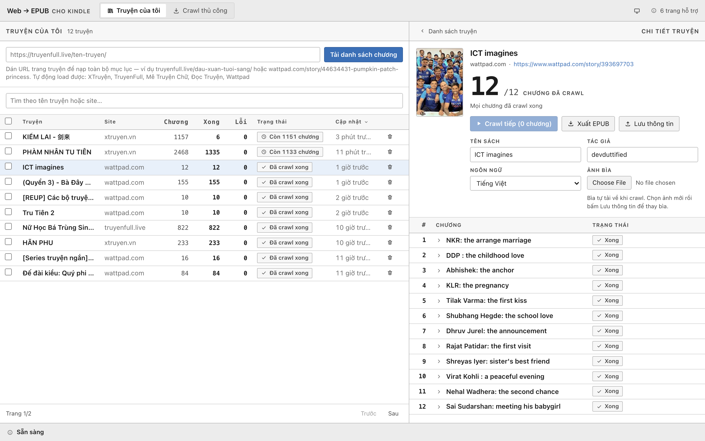
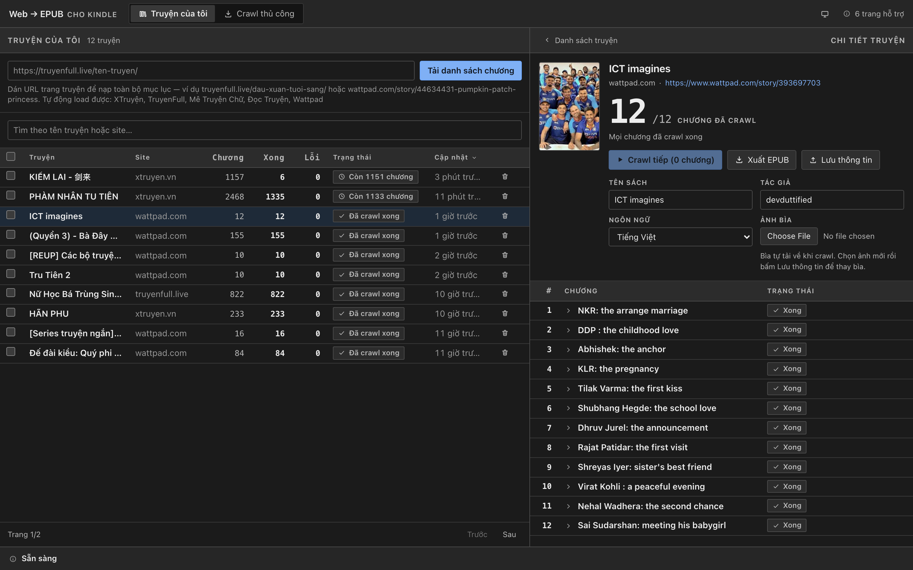

# Web → EPUB

[](https://hub.docker.com/r/vfakhuongdv/web-to-epub)
[](https://github.com/vfa-khuongdv/web-to-epub/releases)

Crawl stories from the web and package them as **EPUB** files readable on Kindle. Extracts
content **actually displayed on the page**, even when the site uses CSS/JS to prevent selection,
copying, or right-click.

> This tool only processes content you already have access to. It **does not** bypass login,
> paywalls, or DRM — locked chapters will report a clear error instead of attempting to bypass.



Dark theme (click the icon in the header to change, or set to "auto" to follow OS):



## Table of Contents

- [Features](#features)
- [Supported Sites](#supported-sites)
- [Installation](#installation)
- [Usage](#usage)
- [Configuration](#configuration)
- [API](#api)
- [Project Structure](#project-structure)
- [Development](#development)
- [Packaging & Release](#packaging--release)
- [How It Works](#how-it-works)
- [Known Limitations](#known-limitations)

## Features

- **Automatic chapter list loading** — paste a story URL and the tool loads the entire table
  of contents, then crawls sequentially.
- **Progress is never lost** — each chapter is saved to SQLite as soon as crawling completes.
  Close the tab mid-crawl, reopen and you'll see the exact `done/total` and can continue.
- **Real-time progress tracking** — crawl runs in background, progress pushed via SSE so all
  open tabs see the same state, no F5 needed.
- **Automatic cover images** — pulls cover from story page, detects format via magic bytes so
  even CDN URLs with generic `content-type` save with correct format.
- **Edit chapters and save** — crawled content often mixes page chrome, ads, or repeated
  chapter names; edit title and content in the chapter table, click **Save Chapter** to persist
  to library, reopen and it's still there.
- **Library management** — status column shows which stories are complete or how many chapters
  remain, search by name (diacritics optional), click column headers to sort — hold Shift for
  secondary sort — paginated view, and select multiple stories to delete at once.
- **Watch for new chapters** — enable notifications for stories you're reading; app auto-checks
  the table of contents on launch and reports "N new chapters" (with manual check button).
  Click "Load N new chapters" to reload the TOC and crawl only the missing parts — no background
  progress, no automatic crawling.
- **Remaining time estimate** — during crawl, ETA and chapters/minute show in the progress bar
  and story detail.
- **Crawl finished notification** — a toast reports "Downloaded N chapters" when a background
  crawl ends, even if you have navigated to another story or back to the library.
- **Supported sites at a glance** — click the site count in the header to see every accepted
  domain without leaving the page.
- **Fast open for massive stories** — chapter list doesn't include content, chapters only load
  when opened; the chapter table is paginated (100 chapters/page).
- **Handle failed chapters** — retry individual chapters, or manually paste content for chapters
  that won't extract.
- **Light/dark theme** — one button in the header, cycles auto → light → dark; auto follows
  OS preferences.
- **Standard EPUB** — TOC (NCX + nav), metadata, cover image, and chapter images downloaded and
  embedded directly in the file.
- **Audio/video in chapters** — `<audio>`/`<video>` tags from source pages are downloaded and
  embedded in EPUB, playable immediately in compatible readers (Apple Books, Thorium, Calibre).
  Kindle can't play them so a link to the source is shown instead.
- **Three deployment modes** — Node.js server, Docker container, or native macOS app.

## Supported Sites

Whitelist is in [`src/config/supportedSites.ts`](src/config/supportedSites.ts);
adding a new domain only requires editing this file.

| Site | Auto-load TOC | Notes |
|---|---|---|
| `xtruyen.vn` | ✅ (site JSON API) | Most thoroughly tested |
| `truyenfull.live` / `truyenfull.vn` | ✅ (scrape TOC pages) | Real-world tested |
| `truyencom.com` | ✅ (scrape TOC pages) | |
| `truyenhoan.com` | ✅ (scrape TOC pages) | Same theme as truyenfull; chapters served in HTML |
| `wattpad.com` | ✅ (internal API `/api/v3/stories/<id>`) | Paid chapters not supported |

## Installation

### Docker (recommended)

Multi-arch image (`linux/amd64` + `linux/arm64`), no need to install Node or Chromium:

```bash
docker run -d -p 3100:3100 -v "$PWD/data:/app/data" vfakhuongdv/web-to-epub:latest
```

Or use the included [`docker-compose.yml`](docker-compose.yml):

```bash
docker compose up -d
```

Open `http://localhost:3100`.

### macOS App

Download `.dmg` from [Releases](https://github.com/vfa-khuongdv/web-to-epub/releases),
drag the app to `/Applications`, then run **once** in Terminal:

```bash
xattr -dr com.apple.quarantine "/Applications/Web to EPUB.app"
```

This step is required because the app is signed ad-hoc (no Apple Developer account).
Skip it and macOS will report *"Apple could not verify..."*.

Release builds **only run on Apple Silicon**. Intel Macs need to build from source
(see [Packaging & Release](#packaging--release)).

### From Source

Requires **Node.js ≥ 22** (uses `node:sqlite` built-in, available since Node 22.5).
Project uses npm workspaces so `npm install` in the root directory installs for
both root and `frontend/`.

```bash
npm install
npx playwright install chromium   # Chromium headless for Playwright (~200MB)
npm run build                     # tsc (backend) + vite build (frontend -> public/)
npm start
```

All these commands are in the `Makefile` — run `make` to see the full list.

## Usage

1. Paste a story URL (e.g., `https://example.com/story-name/`)
   and click "Load chapter list".
2. Click "Crawl" — progress updates in real time, closing the tab doesn't lose progress.
   A toast tells you when the crawl has finished.
3. Open story detail to edit book name / author / cover image, edit chapter names and
   content if needed.
4. Click "Export EPUB" — the book includes every chapter with content.

Failed chapters show a red frame with a "Retry" button and an "Enter content manually"
button to paste content directly.

Not sure which sites are accepted? Click the site count in the header for the full list.

## Configuration

| Variable | Default | Meaning |
|---|---|---|
| `PORT` | `3100` | HTTP port |
| `DATA_DIR` | `./data` | Where to save `stories.db` and `covers/`. macOS app points to `~/Library/Application Support/web-to-epub/data` |
| `CHROMIUM_NO_SANDBOX` | — | Set to `1` to disable Chromium sandbox. Docker image enables this by default because containers have no user namespace; leave empty for local runs |

All data lives in `DATA_DIR` — backing up that directory backs up the entire library.
Docker deployments **must** mount a volume to `/app/data`, otherwise deleting the container
wipes everything.

## API

Backend serves both the built frontend and a REST API under `/api`.

| Method | Endpoint | Description |
|---|---|---|
| `GET` | `/api/supported-sites` | List of allowed crawl domains |
| `GET` | `/api/stories` | List of stories in library |
| `POST` | `/api/stories` | `{ url }` — load TOC from story URL, download cover, save to library |
| `GET` | `/api/stories/:id` | Story detail + chapter list (**without** content, so thousand-chapter stories still open fast) |
| `GET` | `/api/stories/:id/chapters/:order` | One chapter's content, fetched when user opens it |
| `POST` | `/api/stories/:id/crawl` | `{ orders? }` — crawl in background, return `202` immediately |
| `POST` | `/api/stories/:id/meta` | Save book name / author / language / cover image (multipart when image included) |
| `POST` | `/api/stories/:id/watch` | `{ watching }` — enable/disable new chapter notifications |
| `POST` | `/api/stories/:id/check` | Check TOC, return `{ newChapterCount, lastCheckedAt, checkError }` |
| `POST` | `/api/stories/:id/refresh` | Reload TOC for existing story — old chapters keep content, new ones become `pending` |
| `PATCH` | `/api/stories/:id/chapters/:order` | `{ title, contentHtml }` — save user-edited title & content for one chapter |
| `GET` | `/api/stories/:id/cover` | Saved cover image |
| `GET` | `/api/stories/live` | **SSE** — progress of all crawling stories (with `storyId`) |
| `GET` | `/api/stories/:id/live` | **SSE** — progress of one story |
| `POST` | `/api/cover-upload` | Upload temporary cover image (multipart) |
| `POST` | `/api/stories/:id/export` | `{ metadata, chapters }` — build EPUB from DB content, client only sends chapters being edited |

## Project Structure

```
.
├── src/                          # Backend (Node + TypeScript + Express)
│   ├── server.ts                 # Start Express, serve public/ + API
│   ├── config/
│   │   ├── paths.ts              # DATA_DIR
│   │   └── supportedSites.ts     # Domain whitelist
│   ├── routes/                   # /api endpoints, one module per resource
│   │   ├── index.ts              # Router + X-Lang middleware + mounts
│   │   ├── library.ts            # Public/private library, per-request selection
│   │   ├── stories.ts            # Story CRUD, TOC, meta, watch/check
│   │   ├── chapters.ts           # Chapter content load/save
│   │   ├── highlights.ts         # Reader highlights
│   │   ├── crawl.ts              # Background story crawl
│   │   ├── live.ts               # SSE live channels
│   │   └── exports.ts            # EPUB build + download
│   └── services/
│       ├── renderer.ts           # Playwright: render page + auto-scroll
│       ├── extractor.ts          # Readability + filter chrome + DOM -> blocks
│       ├── crawl.ts              # Crawl loop + automatic retries
│       ├── epubBuilder.ts        # Chapters + metadata -> EPUB buffer
│       ├── storyStore.ts         # SQLite: stories and chapters tables
│       ├── coverStore.ts         # Download & save cover images
│       ├── toc/                  # TOC adapters for each site
│       └── chapters/             # Chapter fetcher specific to Wattpad
├── frontend/                     # React + TypeScript, built with Vite
│   └── src/
│       ├── components/           # LibraryView, StoryDetail, ChapterCard...
│       ├── hooks/                # useCrawlJob, useEpubExport
│       ├── lib/                  # API client + pure helpers
│       ├── vault/                # Private-mode provider + token
│       └── i18n/                 # One locale file per language
├── electron/main.js              # Main process for macOS app
├── scripts/                      # Icon generation, ad-hoc signing
├── public/                       # Frontend build output (auto-generated)
├── data/                         # Library: stories.db + covers/ (not committed)
├── Dockerfile                    # Multi-stage image
└── Makefile                      # Run `make help` to see all commands
```

## Development

```bash
make dev            # backend: tsc --watch + nodemon
make dev-frontend   # frontend: Vite dev server (HMR, proxy /api -> :3100)
make test           # vitest
```

`public/` is **generated** by `npm run build` — edit in `frontend/src/`
not directly in the output.

## Packaging & Release

```bash
make docker-build   # image for current machine
make docker-push    # multi-arch amd64 + arm64 to Docker Hub
make app            # macOS app -> release/*.dmg
make release-mac    # build app then update .dmg file on GitHub release
```

**Docker**: multi-stage — builder stage runs `npm run build`, runtime stage only installs
production dependencies plus Playwright's Chromium and runs as user `node`.

**macOS App**: Electron runs the Express server directly then opens a window pointing to
localhost (random port to avoid conflicts). Playwright's Chromium (built as `--only-shell`, 195MB)
lives in `Contents/Resources/` so no installation needed on user machines. `.dmg` file is ~217MB,
unpacked app ~520MB. Intel Macs need `electron-builder --mac --x64` and x64 Chromium — building
on the actual Intel machine is most reliable.

## How It Works

```
URL ──▶ Renderer ──▶ Extractor ──▶ Blocks ──▶ Preview/Edit ──▶ EPUB Builder ──▶ .epub
       Playwright   Readability   (SQLite)      (React)          epub-gen
```

1. **Render** (`renderer.ts`) — Playwright opens the page like a real browser, runs all
   JS/CSS, auto-scrolls to trigger lazy-load, then reads `page.content()`.
2. **Extract** (`extractor.ts`) — Readability extracts main content, custom filter removes
   remaining menus/ads/related posts, then walks DOM into `ContentBlock` types
   (`heading` / `paragraph` / `image`).
3. **Save** (`storyStore.ts`) — each chapter is written to SQLite in its own transaction
   as soon as it completes.
4. **Export** (`epubBuilder.ts`) — gather checked chapters + metadata and call `epub-gen`.

**Why can it bypass copy restrictions?** The renderer doesn't simulate user selection/copy
actions — it reads the rendered DOM tree directly from the server. `user-select: none`,
`oncopy`, `oncontextmenu`, or JS that blocks keyboard shortcuts only affects **behavior in
the user's browser**, not code reading the DOM.

**Images in chapters** are downloaded **before** passing to `epub-gen`, and file extension
comes from magic bytes not URL guessing. Reason: `epub-gen` guesses via `mime.getType(url)`,
so URLs without extensions (very common with CDN images) produce `<id>.null` with empty
`media-type=""` — ebook readers can't display the image and the EPUB is non-standard.
Failed image downloads skip the `` tag entirely instead of leaving a broken reference.

**Audio/video** go one step further: `epub-gen` knows nothing about them — it only packages
`` tags, and its attribute filter removes `controls` (the only thing that shows the play
button). So media files are downloaded first, `src` points to `media/<n>.<ext>` in the book,
then after `epub-gen` finishes, the EPUB file is reopened and patched: media files added, entries
added to the manifest, and `controls` restored. Files over 50MB or with download errors (streaming
links, host-blocked) become a text block with a link to the source, rather than disappearing entirely.

## Known Limitations

- **Only crawl whitelisted domains.** Of these, only `xtruyen.vn` and `truyenfull.live` have
  real-world testing; others were added on request so verify extraction quality before trusting.
- **Extraction can fail inconsistently** on some sites (especially `xtruyen.vn`) due to delayed
  content loads, even after 3 automatic retries — use the "Retry" button on the UI.
- **Anti-ad-blocker walls** (seen on `truyenfull.live`) cause chapters to error. The tool
  intentionally **does not** bypass these; use "Enter content manually" if you've already viewed
  the content in a regular browser.
- **Wattpad**: chapters load via standard HTTP (faster than opening a browser) because the site
  server-renders content. Paid Stories report an error, no bypass. The TOC API is internal and
  undocumented — if the site changes it, the adapter will error clearly.
- **"Load more" buttons** aren't clicked automatically yet; currently only auto-scroll to trigger
  lazy-load via scroll events.
- **Watch for new chapters only runs while the app is open** — each watched story costs one TOC
  fetch, maximum 2 in parallel, no background progress. Detection is URL-based: chapters that
  change URL still count as new, chapters removed from TOC aren't reported.
- **ETA is an estimate** based on average speed of the current crawl — slow chapters or retries
  change the number; only shows after several chapters and doesn't persist across server restart.
- **Tables (`<table>`)** are flattened into separate paragraphs.
- **No automatic login** — sites requiring login are out of scope.
- **Chapter names depend on the site's TOC.** `xtruyen.vn` TOC only returns chapter numbers
  ("Volume 1 Chapter 2"); subtitles ("… : Opening") sit on individual chapter pages so only
  appear after crawling. Chapters crawled from old backups keep their old names — crawl again
  to update.
- **Older Kindle models** only read MOBI/AZW3 — use Calibre to convert:
  `ebook-convert book.epub book.azw3`. Newer Kindle firmware, "Send to Kindle", and the Kindle
  app read EPUB directly.
- **`epub-gen` is an old library**, pulling in dependencies with some audit warnings.
  Acceptable for local-only tools; long-term use might warrant switching to a newer EPUB writer.
